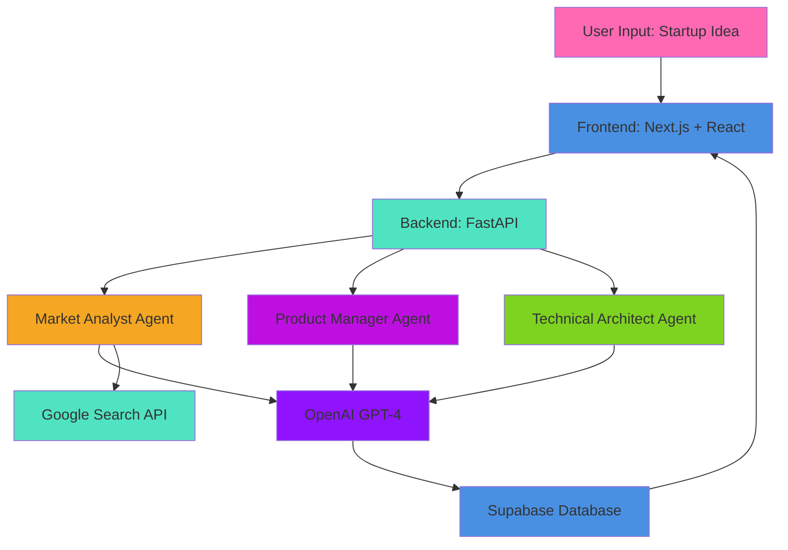

<div align="center">

# 🚀 Startup MVP Builder

### Transform Your Startup Ideas into Complete MVP Blueprints with AI

<p align="center">
  
  
  
  
  
</p>

<p align="center">
  <a href="#-features">Features</a> •
  <a href="#-architecture">Architecture</a> •
  <a href="#-getting-started">Getting Started</a> •
  <a href="#-tech-stack">Tech Stack</a> •
  <a href="#-api-documentation">API Docs</a>
</p>


</div>

---

## 🌟 Overview

**Startup MVP Builder** is an AI-powered platform that transforms your startup ideas into comprehensive, actionable MVP blueprints. Using a chain of three specialized AI agents, it analyzes your market, designs your product roadmap, and generates a complete technical architecture—all in minutes.

### 💡 The Problem It Solves

Building a startup MVP is overwhelming.  Founders face:
- 📊 **Market uncertainty** - Is there really a market for this?
- 🎯 **Feature prioritization** - What should we build first?
- 🏗️ **Technical decisions** - Which tech stack is best?
- ⏰ **Time constraints** - Months of planning before coding

### ✨ Our Solution

Get a complete MVP blueprint in minutes with: 
- **Market Analysis** - TAM/SAM/SOM sizing, competitor analysis, opportunity scoring
- **Product Roadmap** - User personas, feature prioritization, MVP definition
- **Technical Architecture** - Tech stack recommendations, database schema, API design

---

## 🎯 Features

### 🔍 Market Analyst Agent
- **Comprehensive Market Research** - Real-time data gathering using Google Search API
- **Competitor Analysis** - Deep dive into competitors with scoring (1-10)
- **Market Sizing** - TAM, SAM, SOM calculations
- **Trend Analysis** - Emerging trends, technology shifts, consumer behavior
- **Opportunity Scoring** - AI-powered market opportunity assessment
- **Risk Analysis** - Market, competitive, technology, and regulatory risks

### 🗺️ Product Manager Agent
- **User Persona Generation** - Detailed personas with demographics and pain points
- **Feature Prioritization** - HIGH/MEDIUM/LOW priority with effort/impact scoring
- **MVP Definition** - Clear MVP feature set with milestone planning
- **Validation Experiments** - Structured approach to test key assumptions
- **Success Metrics** - KPIs to measure product success

### 🏗️ Technical Architect Agent
- **Tech Stack Recommendations** - Frontend, Backend, Database, DevOps tools
- **Database Schema Design** - Complete schema with relationships and constraints
- **API Endpoint Design** - RESTful API structure with auth requirements
- **Deployment Strategy** - CI/CD pipeline, scaling strategy, cost estimates
- **Security Considerations** - Authentication, authorization, encryption strategies
- **Architecture Diagrams** - Visual Mermaid. js diagrams
- **Implementation Roadmap** - Phased development timeline

### 🎨 Beautiful UI/UX
- **Modern Design** - Pink/red gradient theme with glassmorphism
- **Responsive Layout** - Works seamlessly on desktop and mobile
- **Real-time Progress** - Visual feedback during agent execution
- **Interactive Components** - Smooth animations and transitions
- **Dashboard** - View all your MVP projects in one place
- **History Tracking** - Access previous analyses anytime

---

## 🏛️ Architecture



### Agent Chain Flow

1. **Market Analyst** analyzes your startup idea
   - Conducts market research
   - Analyzes competitors
   - Generates market report

2. **Product Manager** uses market insights
   - Creates user personas
   - Prioritizes features
   - Defines MVP scope

3. **Technical Architect** designs the solution
   - Recommends tech stack
   - Designs database schema
   - Creates API structure

---

## 🚀 Getting Started

### Prerequisites

- **Node.js** 20+ and npm/yarn/pnpm
- **Python** 3.9+
- **OpenAI API Key** ([Get one here](https://platform.openai.com/api-keys))
- **Google Search API Key** (optional, for enhanced market research)
- **Clerk Account** ([Sign up here](https://clerk.com/))
- **Supabase Account** ([Sign up here](https://supabase.com/))

### 📦 Installation

#### 1. Clone the Repository

```bash
git clone https://github.com/Bhumi1729/startup-mvp-builder.git
cd startup-mvp-builder
```

#### 2. Backend Setup

```bash
cd backend_fastapi

# Create virtual environment
python -m venv venv

# Activate virtual environment
# On Windows:
venv\Scripts\activate
# On macOS/Linux:
source venv/bin/activate

# Install dependencies
pip install -r requirements.txt

# Create .env file
cp .env.example .env

# Add your API keys to .env
# OPENAI_API_KEY=your_openai_api_key_here
# GOOGLE_SEARCH_API_KEY=your_google_search_api_key_here
# SUPABASE_URL=your_supabase_url_here
# SUPABASE_KEY=your_supabase_key_here
```

#### 3. Frontend Setup

```bash
cd ../frontend

# Install dependencies
npm install
# or
yarn install
# or
pnpm install

# Create .env. local file
cp .env.local.example .env.local

# Add your environment variables
# NEXT_PUBLIC_CLERK_PUBLISHABLE_KEY=your_clerk_publishable_key
# CLERK_SECRET_KEY=your_clerk_secret_key
# NEXT_PUBLIC_API_URL=http://127.0.0.1:8000
```

### ▶️ Running the Application

#### Start Backend Server

```bash
cd backend_fastapi
uvicorn main:app --reload
```

The API will be available at `http://127.0.0.1:8000`

#### Start Frontend Development Server

```bash
cd frontend
npm run dev
# or
yarn dev
# or
pnpm dev
```

The app will be available at `http://localhost:3000`

### 🎬 Using the Application

1. **Sign Up/Sign In** - Create an account using Clerk authentication
2. **Enter Your Idea** - Describe your startup idea in the form
3. **Watch the Magic** - Three AI agents work sequentially to analyze your idea
4. **Review Results** - Explore your comprehensive MVP blueprint
5. **Access History** - View all your past analyses from the dashboard

---

## 🛠️ Tech Stack

### Frontend
| Technology | Purpose |
|-----------|---------|
| **Next.js 15.3.3** | React framework with App Router |
| **React 19** | UI library |
| **TypeScript 5.8** | Type safety |
| **Tailwind CSS 4** | Utility-first styling |
| **Clerk** | Authentication & user management |
| **Framer Motion** | Animations |
| **Lucide React** | Beautiful icons |
| **Mermaid. js** | Architecture diagrams |

### Backend
| Technology | Purpose |
|-----------|---------|
| **FastAPI** | Modern Python web framework |
| **Pydantic** | Data validation |
| **OpenAI GPT-4o-mini** | AI agent intelligence |
| **Supabase** | PostgreSQL database |
| **Python-dotenv** | Environment management |
| **BeautifulSoup4** | Web scraping |
| **Uvicorn** | ASGI server |

---

## 📚 API Documentation

### Base URL
```
http://127.0.0.1:8000
```

### Endpoints

#### `GET /`
Returns API information and available endpoints. 

**Response:**
```json
{
  "message": "Welcome to Startup MVP Builder API",
  "endpoints": [...]
}
```

#### `POST /market-analyst`
Analyzes market opportunities for a startup idea.

**Request:**
```json
{
  "startup_idea": "AI-powered fitness app",
  "user_id": "user_123",
  "session_id": "session_456"
}
```

**Response:** Detailed market analysis report

#### `POST /product-manager`
Generates product roadmap from market analysis.

**Request:**
```json
{
  "market_report": { ...  },
  "user_id":  "user_123",
  "session_id": "session_456"
}
```

**Response:** Comprehensive product roadmap

#### `POST /technical-architect`
Creates technical blueprint from product roadmap.

**Request:**
```json
{
  "product_roadmap": { ... },
  "user_id": "user_123",
  "session_id": "session_456"
}
```

**Response:** Complete technical architecture

#### `GET /outputs/user/{user_id}`
Retrieves all analyses for a specific user.

#### `POST /outputs/session`
Retrieves analysis for a specific session.

**Request:**
```json
{
  "session_id": "session_456"
}
```

For detailed API documentation, visit `http://127.0.0.1:8000/docs` when running the backend. 

---

## 🗂️ Project Structure

```
startup-mvp-builder/
├── backend_fastapi/
│   ├── main.py                      # FastAPI application entry point
│   ├── market_agent.py              # Market Analyst agent logic
│   ├── product_manager.py           # Product Manager agent logic
│   ├── tech_architect_updated.py    # Technical Architect agent logic
│   ├── supabase_client.py           # Database operations
│   ├── json_helper_updated.py       # JSON parsing utilities
│   ├── requirements.txt             # Python dependencies
│   └── README.md                    # Backend documentation
│
├── frontend/
│   ├── app/
│   │   ├── components/              # Reusable UI components
│   │   │   ├── LandingPageHero.tsx
│   │   │   ├── FeatureSection.tsx
│   │   │   ├── AboutSection.tsx
│   │   │   ├── Footer.tsx
│   │   │   ├── MarketAnalysisDisplay.tsx
│   │   │   ├── ProductRoadmapDisplay.tsx
│   │   │   └── TechArchitectDisplay.tsx
│   │   ├── dashboard/               # Dashboard pages
│   │   │   ├── page.tsx             # Main dashboard
│   │   │   ├── MainDashboard.tsx    # Dashboard logic
│   │   │   ├── new/
│   │   │   │   └── page.tsx         # New MVP form
│   │   │   └── history/
│   │   │       └── [sessionId]/
│   │   │           └── page.tsx     # MVP details view
│   │   ├── utils/                   # Utility functions
│   │   │   ├── agentChain.ts        # Agent orchestration
│   │   │   ├── apiUtils.ts          # API helpers
│   │   │   └── mvpUtils.ts          # MVP utilities
│   │   ├── actions/                 # Server actions
│   │   │   └── auth.ts              # Authentication actions
│   │   ├── layout.tsx               # Root layout
│   │   ├── page.tsx                 # Landing page
│   │   └── globals.css              # Global styles
│   ├── package.json                 # Node dependencies
│   └── README.md                    # Frontend documentation
│
└── README.md                        # This file
```

---

## 🔐 Environment Variables

### Backend (. env)
```env
OPENAI_API_KEY=sk-...                      # OpenAI API key
GOOGLE_SEARCH_API_KEY=AIza...             # Google Search API key (optional)
SUPABASE_URL=https://...supabase.co       # Supabase project URL
SUPABASE_KEY=eyJh...                      # Supabase anon/public key
```

### Frontend (.env.local)
```env
NEXT_PUBLIC_CLERK_PUBLISHABLE_KEY=pk_...  # Clerk publishable key
CLERK_SECRET_KEY=sk_...                   # Clerk secret key
NEXT_PUBLIC_API_URL=http://127.0.0.1:8000 # Backend API URL
```

---

## 🎨 Key Features Showcase

### 1. **Real-time Agent Progress**
Watch as three AI agents work sequentially:
- 📊 Market Analysis (analyzing opportunities)
- 🗺️ Product Roadmap (creating your plan)
- 🏗️ Technical Blueprint (designing architecture)

### 2. **Comprehensive Market Analysis**
- Total Addressable Market (TAM) sizing
- Competitive landscape with 10+ competitors analyzed
- Market opportunity scoring (1-10 scale)
- Risk analysis with mitigation strategies

### 3. **Smart Feature Prioritization**
- Impact vs Effort matrix visualization
- MVP vs Future milestone categorization
- Technical complexity assessment
- Dependency tracking

### 4. **Production-Ready Tech Stack**
- Justification for each technology choice
- Alternative technologies considered
- Learning curve assessment
- Community support evaluation

### 5. **Visual Architecture Diagrams**
- Auto-generated Mermaid. js diagrams
- Component relationships
- Data flow visualization

---

## 🚧 Development

### Running Tests

```bash
# Backend tests (if implemented)
cd backend_fastapi
pytest

# Frontend tests (if implemented)
cd frontend
npm test
```

### Code Quality

```bash
# Frontend linting
cd frontend
npm run lint

# Format code
npm run format
```

---

## 🌐 Deployment

### Frontend (Vercel)
```bash
cd frontend
vercel deploy
```

### Backend (Render/Railway)
1. Connect your GitHub repository
2. Set environment variables
3. Deploy with `uvicorn main:app --host 0.0.0.0 --port $PORT`

---

## 🤝 Contributing

Contributions are welcome! Please follow these steps:

1. Fork the repository
2. Create a feature branch (`git checkout -b feature/AmazingFeature`)
3. Commit your changes (`git commit -m 'Add some AmazingFeature'`)
4. Push to the branch (`git push origin feature/AmazingFeature`)
5. Open a Pull Request

---

## 📝 License

This project is licensed under the MIT License - see the [LICENSE](LICENSE) file for details.

---

## 👤 Author

**Bhumika Yadav**

- GitHub: [@Bhumi1729](https://github.com/Bhumi1729)
- LinkedIn: [Bhumika Yadav](https://www.linkedin.com/in/bhumika-yadav/)

---

## 🙏 Acknowledgments

- [OpenAI](https://openai.com/) for GPT-4 API
- [Clerk](https://clerk.com/) for authentication
- [Supabase](https://supabase.com/) for database
- [Vercel](https://vercel.com/) for Next.js framework
- [FastAPI](https://fastapi.tiangolo.com/) for the amazing Python framework

---

## 📧 Support

If you have any questions or issues, please: 
1. Check the [documentation](https://github.com/Bhumi1729/startup-mvp-builder#-getting-started)
2. Open an [issue](https://github.com/Bhumi1729/startup-mvp-builder/issues)
3. Contact via [LinkedIn](https://www.linkedin.com/in/bhumika-yadav/)

---

<div align="center">

### ⭐ Star this repo if you find it helpful!

**Built with ❤️ by Bhumika Yadav**

</div>
